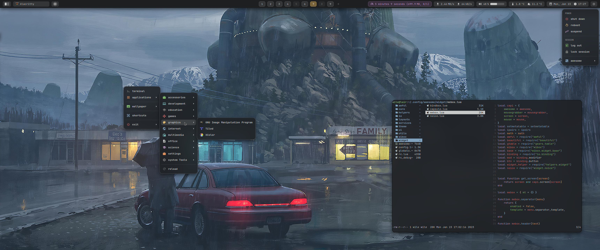
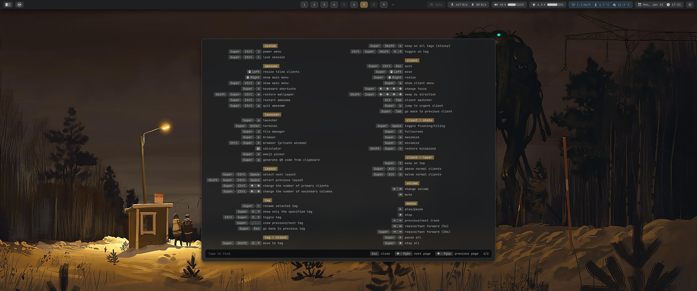
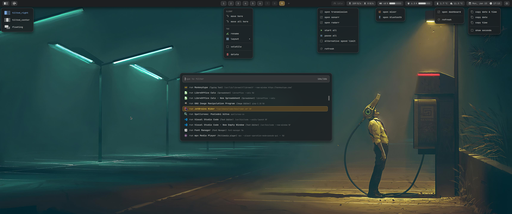
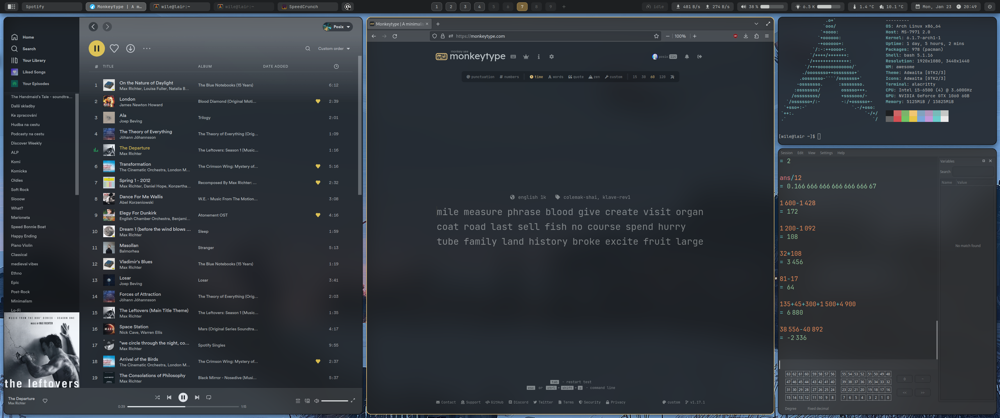

# AwesomeWM rice

(Yet another) Config for [Awesome](https://github.com/awesomeWM/awesome) window manager.


# Dependencies

The following package names are from the Arch repositories or AUR.

## Required

- `awesome-git` - window manager (latest git version, **not** stable v4.3)
- `pulsemixer` - controlling the system volume
- `playerctl` - controlling media player
- `xdg-open` (from `xdg-utils`) - opening files or URLs in the preferred applications
- `xclip` - copying things to the clipboard
- `yay/pacman/aurc` - Requires a package manager to install dependencies from the AUR and non-aur, can include [`Aurc`](https://github.com/statulr/aurc), [`Pacman`](https://gitlab.archlinux.org/pacman/pacman), or/and for some dependencies [`yay`](https://github.com/Jguer/yay)
## Optional

- [`feh`](https://archlinux.org/packages/extra/x86_64/feh/) - setting wallpaper
- [`luarocks`](https://luarocks.org/) - Requires luarocks and the lua package to install dkjson and any other potential lua-modules
- `dkjson` - Reading JSON Lua Module (Required for Weather and Other Widgets) Install via ```sudo luarocks install dkjson```
- [`maim`](https://github.com/naelstrof/maim), [`xdotool`](https://github.com/jordansissel/xdotool) - taking a screenshot
- [`slop`](https://archlinux.org/packages/extra/x86_64/slop/) - magnifier (required [`boxzoom`](https://github.com/naelstrof/slop/tree/master/shaderexamples) shader), also screen region selection
- [`sct`](https://flak.tedunangst.com/post/sct-set-color-temperature) - setting the color temperature of the screen

## Recommended

- [`rofi`](https://github.com/davatorium/rofi) - application launcher ([here](https://gist.github.com/kosorin/2e613eb2e09f4f619b3f9f6c3c688c6b) is the config to match the style of this rice)
- [`picom`](https://github.com/yshui/picom) - compositor for a better look

## Fonts

- Nerd Font - use any Nerd Font that you like
Here are some recommendations:
[Iosevka Nerd Font](https://archlinux.org/packages/extra/any/ttf-iosevka-nerd/)
[JetBrains Mono Nerd Font](https://archlinux.org/packages/extra/any/ttf-jetbrains-mono-nerd/)
[Firacode Nerd](https://archlinux.org/packages/extra/any/ttf-firacode-nerd/)


# Installation
### Manual
Backup your current config and download the files from GitHub to the empty `~/.config/awesome` directory:

    $ git clone https://github.com/kosorin/awesome-rice.git ~/.config/awesome

### Auto Installer
You may use our autoinstall script, which is only supported on Arch Linux for now (this does not configure your .xinitrc) 
```sh
git clone https://github.com/kosorin/awesome-rice.git ~/arice
cd arice
chmod +x install.sh
./install.sh
```
- Be aware we always recommend manual installation as everyone's computer is different, and sometimes there might be problems depending on what you have installed

# Setup

Some [dependencies](#dependencies) are not listed and can be changed in `config.lua` file. So go ahead and set up your preferred applications.

In `theme/theme.lua` you can change font or icon theme.


# Gallery

## Screenshots










# Credits

- Simon Stålenhag (wallpapers)
